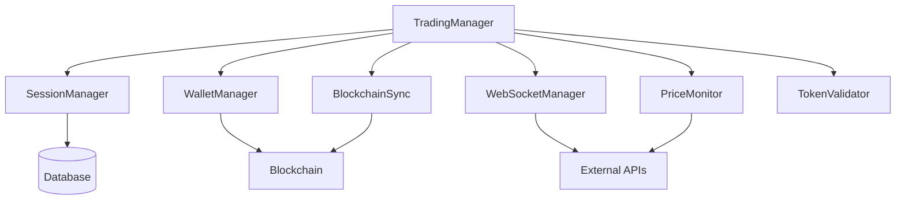

# Архітектура системи

## Огляд

Система побудована за модульним принципом з використанням асинхронного програмування та подійно-орієнтованої архітектури. Основні компоненти системи розділені на окремі модулі, що взаємодіють через чітко визначені інтерфейси.

## Основні компоненти

### TradingManager
- Головний компонент системи
- Координує роботу всіх інших компонентів
- Обробляє торгові сигнали
- Керує життєвим циклом торгових сесій

### SessionManager
- Керує торговими сесіями
- Відстежує активні сесії
- Зберігає історію сесій
- Забезпечує відновлення після збоїв

### WalletManager
- Керує гаманцями
- Відстежує баланси
- Виконує транзакції
- Забезпечує безпеку коштів

### BlockchainSync
- Синхронізація з блокчейном
- Відстеження транзакцій
- Обробка нових блоків
- Валідація транзакцій

### WebSocketManager
- Керує WebSocket з'єднаннями
- Обробляє вхідні повідомлення
- Забезпечує надійність з'єднання
- Реалізує механізм переп

### PriceMonitor
- Моніторинг цін токенів
- Розрахунок технічних індикаторів
- Генерація сигналів
- Відстеження волатильності

### TokenValidator
- Валідація токенів
- Перевірка ліквідності
- Аналіз смарт-контрактів
- Оцінка ризиків

## Взаємодія компонентів

## Потік даних

1. Отримання сигналу
   - WebSocketManager отримує сигнал
   - Передає його в TradingManager
   - TradingManager валідує сигнал

2. Валідація токену
   - TokenValidator перевіряє токен
   - Аналізує ліквідність
   - Оцінює ризики

3. Відкриття позиції
   - WalletManager перевіряє баланси
   - Виконує транзакцію
   - BlockchainSync відстежує статус

4. Моніторинг позиції
   - PriceMonitor відстежує ціну
   - Розраховує індикатори
   - Генерує сигнали на вихід

5. Закриття позиції
   - TradingManager приймає рішення
   - WalletManager закриває позицію
   - SessionManager оновлює статистику

## Обробка помилок

### Рівні обробки
1. Рівень компонента
   - Локальна обробка помилок
   - Логування
   - Спроби відновлення

2. Рівень системи
   - Координація відновлення
   - Сповіщення адміністратора
   - Збереження стану

### Стратегії відновлення
1. Автоматичне
   - Повторні спроби
   - Fallback сценарії
   - Часткове відновлення

2. Ручне
   - Сповіщення адміністратора
   - Інструкції з відновлення
   - Аналіз причин

## Масштабування

### Горизонтальне
- Додавання нових торгових пар
- Розподіл навантаження
- Реплікація даних

### Вертикальне
- Оптимізація продуктивності
- Покращення алгоритмів
- Оновлення інфраструктури

## Безпека

### Рівні захисту
1. Мережевий
   - SSL/TLS
   - Фільтрація трафіку
   - Rate limiting

2. Додаток
   - Валідація вхідних даних
   - Шифрування чутливих даних
   - Аудит дій

3. Дані
   - Бекапи
   - Шифрування
   - Контроль доступу

## Моніторинг

### Метрики
- Продуктивність системи
- Статистика торгів
- Використання ресурсів
- Помилки та попередження

### Сповіщення
- Критичні події
- Аномалії
- Досягнення лімітів
- Помилки системи

## Розгортання

### Вимоги
- Python 3.8+
- PostgreSQL
- Redis
- Docker

### Кроки
1. Підготовка середовища
2. Налаштування конфігурації
3. Запуск компонентів
4. Верифікація роботи

## Тестування

### Рівні
1. Модульні тести
   - Компоненти
   - Функції
   - Класи

2. Інтеграційні тести
   - Взаємодія компонентів
   - API
   - База даних

3. Системні тести
   - End-to-end сценарії
   - Навантажувальне тестування
   - Тестування відмовостійкості 